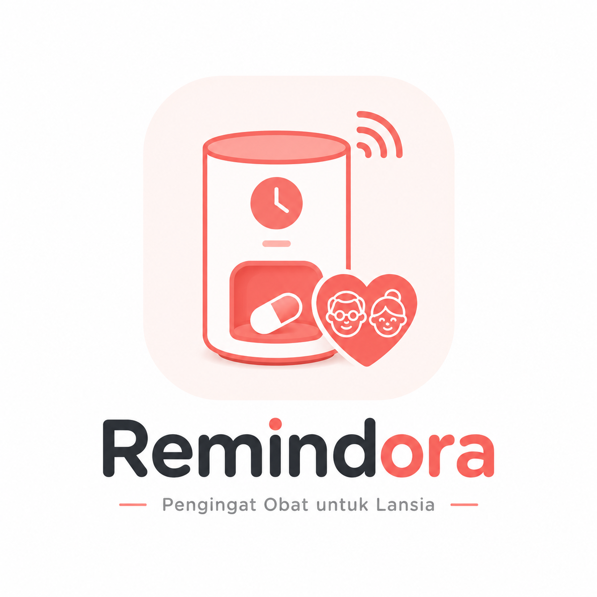

# 💊 Obatku

<p align="center">
  
</p>

<h3 align="center">Smart Medication Monitoring & Reminder App</h3>

<p align="center">
  Aplikasi mobile berbasis <b>Flutter</b> yang terintegrasi dengan <b>Smart Medicine Dispenser berbasis IoT</b> untuk membantu lansia mengatur jadwal konsumsi obat dan memudahkan keluarga melakukan pemantauan secara jarak jauh.
</p>

<p align="center">
  
  
  
  
  
</p>

---

## 📖 Tentang Obatku

**Obatku** merupakan aplikasi mobile yang dikembangkan sebagai bagian dari sistem **Dispenser Obat Pintar untuk Lansia**.

Sistem dirancang untuk membantu pengguna dalam menjalankan jadwal konsumsi obat secara lebih teratur sekaligus memberikan fasilitas monitoring kepada keluarga.

Aplikasi berkomunikasi dengan perangkat dispenser melalui **MQTT**, sedangkan data pengguna, jadwal obat, monitoring, dan riwayat konsumsi disimpan melalui **Supabase**.

Dengan Obatku, pengguna dapat melihat jadwal obat berikutnya, memantau stok obat, melihat status dispenser, memantau riwayat konsumsi, hingga mengirim perintah pengeluaran obat secara manual ketika perangkat sedang online.

---

## ✨ Fitur Utama

### 🔐 Authentication

* Registrasi pengguna
* Login pengguna
* Manajemen session
* Integrasi Supabase Authentication

### 👥 Multi Role

Obatku mendukung dua jenis pengguna:

**👴 Lansia**

* Melihat jadwal minum obat
* Melihat status dispenser
* Melihat stok obat
* Melihat riwayat konsumsi
* Mengeluarkan obat secara manual ketika dispenser online

**👨‍👩‍👧 Keluarga**

* Menghubungkan akun dengan lansia
* Memantau kondisi dispenser
* Memantau jadwal konsumsi obat
* Melihat riwayat konsumsi obat
* Memantau stok obat dari jarak jauh

---

## 🏠 Dashboard

Dashboard menampilkan informasi utama sistem secara ringkas, antara lain:

* 📡 Status koneksi dispenser
* ⏰ Jadwal obat berikutnya
* 💊 Nama dan jumlah obat
* 📦 Persentase stok obat
* ✅ Ringkasan konsumsi obat hari ini
* 🕐 Riwayat obat terakhir
* 🎛️ Kontrol dispense manual untuk pengguna lansia

---

## 📅 Manajemen Jadwal Obat

Pengguna dapat mengelola informasi jadwal konsumsi obat melalui aplikasi.

Informasi jadwal meliputi:

* Nama obat
* Waktu konsumsi
* Jumlah obat
* Jadwal konsumsi
* Status jadwal

Data jadwal kemudian dapat digunakan oleh sistem dispenser sebagai acuan proses pemberian obat.

---

## 📊 Monitoring

Menu monitoring digunakan untuk melihat kondisi sistem dispenser dan aktivitas konsumsi obat.

Monitoring meliputi:

* Status perangkat
* Status koneksi
* Stok obat
* Riwayat konsumsi
* Ringkasan aktivitas konsumsi
* Data monitoring dari dispenser

---

## 🔔 Notifikasi

Aplikasi menyediakan halaman notifikasi untuk memberikan informasi terkait aktivitas dispenser dan konsumsi obat.

Contohnya:

* Jadwal minum obat
* Obat telah dikeluarkan
* Informasi status konsumsi
* Informasi kondisi dispenser

---

## 🌐 Integrasi IoT

Obatku terhubung dengan **Smart Medicine Dispenser** melalui protokol **MQTT**.

Alur komunikasi sederhananya:

```text
┌──────────────────┐
│     Obatku       │
│  Flutter Mobile  │
└────────┬─────────┘
         │
         │ MQTT
         ▼
┌──────────────────┐
│    MQTT Broker   │
└────────┬─────────┘
         │
         ▼
┌──────────────────┐
│      ESP32       │
│ Smart Dispenser  │
└────────┬─────────┘
         │
         ├── RTC DS3231
         ├── Load Cell
         ├── IR Sensor
         ├── Stepper Motor
         └── DFPlayer Mini
```

Data aplikasi juga terhubung dengan:

```text
Flutter App
     │
     ▼
  Supabase
     │
     ├── Authentication
     ├── Database
     ├── Jadwal Obat
     ├── Data Pengguna
     └── Riwayat Monitoring
```

---

## 🛠️ Tech Stack

| Technology   | Kegunaan                                  |
| ------------ | ----------------------------------------- |
| Flutter      | Pengembangan aplikasi mobile              |
| Dart         | Bahasa pemrograman utama                  |
| Supabase     | Backend, database, dan authentication     |
| MQTT         | Komunikasi real-time dengan perangkat IoT |
| Provider     | State management                          |
| FL Chart     | Visualisasi data                          |
| Google Fonts | Typography                                |
| ESP32        | Mikrokontroler smart dispenser            |

---

## 📦 Package Utama

Beberapa package Flutter yang digunakan pada project:

```yaml
provider
mqtt_client
supabase_flutter
fl_chart
google_fonts
cross_file
path_provider
share_plus
shimmer
```

---

## 📁 Struktur Project

```text
App_dispenser_obat_pintar/
│
├── android/
├── assets/
│   └── images/
│
├── lib/
│   ├── core/
│   │   ├── services/
│   │   └── theme/
│   │
│   ├── models/
│   ├── providers/
│   ├── repositories/
│   ├── screens/
│   ├── widgets/
│   │
│   └── main.dart
│
├── supabase/
├── test/
│
├── DESIGN.md
├── PANDUAN_SETUP_SUPABASE.md
├── pubspec.yaml
└── README.md
```

---

## 🖥️ Halaman Aplikasi

Beberapa halaman utama yang tersedia pada Obatku:

```text
Authentication
├── Login
├── Register
└── Role Gate

Main Application
├── Dashboard
├── Kelola Jadwal
├── Monitoring
├── Notifikasi
├── Hubungkan Lansia
└── Profile
```

---

## 🚀 Menjalankan Project

### 1. Clone repository

```bash
git clone https://github.com/DeasRp/App_dispenser_obat_pintar.git
```

Masuk ke folder project:

```bash
cd App_dispenser_obat_pintar
```

### 2. Install dependencies

```bash
flutter pub get
```

### 3. Pastikan Flutter tersedia

Periksa environment:

```bash
flutter doctor
```

### 4. Hubungkan perangkat Android

Periksa device:

```bash
flutter devices
```

### 5. Jalankan aplikasi

```bash
flutter run
```

---

## 🗄️ Konfigurasi Supabase

Project menggunakan **Supabase** sebagai backend aplikasi.

Sebelum menjalankan project, pastikan konfigurasi berikut sudah tersedia:

```text
Supabase URL
Supabase Anonymous Key
Database Tables
Authentication
Row Level Security
```

Panduan setup Supabase tersedia di:

```text
PANDUAN_SETUP_SUPABASE.md
```

---

## 🔄 Alur Sistem

```text
Pengguna
   │
   ▼
Obatku Mobile App
   │
   ├───────────────► Supabase
   │                   │
   │                   ├── User
   │                   ├── Jadwal
   │                   └── Riwayat
   │
   ▼
MQTT Broker
   │
   ▼
ESP32
   │
   ▼
Smart Medicine Dispenser
   │
   ├── Membaca jadwal
   ├── Mengecek perangkat
   ├── Menggerakkan motor
   ├── Mengeluarkan obat
   └── Mengirim status kembali
```

---

## 🎯 Tujuan Pengembangan

Project ini dikembangkan untuk:

* Membantu lansia mengingat jadwal konsumsi obat.
* Mengurangi risiko obat terlupa atau terlewat.
* Membantu keluarga memantau konsumsi obat dari jarak jauh.
* Memantau jumlah stok obat pada dispenser.
* Mengintegrasikan aplikasi mobile dengan perangkat IoT.
* Mengembangkan sistem monitoring kesehatan sederhana berbasis IoT.

---

## 🔮 Pengembangan Selanjutnya

Beberapa fitur yang dapat dikembangkan lebih lanjut:

* [ ] Push notification real-time
* [ ] Monitoring beberapa lansia sekaligus
* [ ] Grafik kepatuhan konsumsi obat
* [ ] Warning ketika stok obat hampir habis
* [ ] Device pairing melalui QR Code
* [ ] Export riwayat konsumsi obat
* [ ] Integrasi WhatsApp Notification
* [ ] Mode offline
* [ ] Peningkatan keamanan komunikasi MQTT
* [ ] Release aplikasi ke Play Store

---

## 📸 Screenshots

> Tambahkan screenshot aplikasi pada folder `assets/screenshots/`.

Contoh struktur:

```text
assets/
└── screenshots/
    ├── login.png
    ├── dashboard.png
    ├── jadwal.png
    └── monitoring.png
```

Kemudian tampilkan pada README:

```html
<p align="center">
  
  
  
</p>
```

---

## 👨‍💻 Developer

**Deas Rizqi**

Computer Engineering Student
Universitas Gunadarma

GitHub:

[github.com/DeasRp](https://github.com/DeasRp)

---

## 📚 Project

Repository:

[App_dispenser_obat_pintar](https://github.com/DeasRp/App_dispenser_obat_pintar)

Project ini dikembangkan sebagai bagian dari penelitian dan pengembangan **Dispenser Obat Pintar untuk Lansia berbasis Internet of Things (IoT)**.

---

<p align="center">
  Made with ❤️ using Flutter, Supabase & IoT
</p>

<p align="center">
  <b>Obatku — Membantu menjaga jadwal obat, satu dosis pada satu waktu. 💊</b>
</p>
